# 4. Debugging and Profiling on TensorBoard-Neuron

## Installation
1.1 By default, TensorBoard-Neuron will be installed when you install TensorFlow-Neuron.  If you already have installed tensorflow-neuron, skip this step

```
$ pip install tensorflow-neuron
```

1.2 TensorBoard-Neuron can also be installed separately.

```
$ pip install tensorboard-neuron
```

1.3 Additionally, if you would like to profile your model (see below), you will also need to have Neuron tools installed.

```
$ sudo apt install aws-neuron-tools
```


## Profile the network and collect inference traces

When using TensorFlow-Neuron, MXNet-Neuron, or PyTorch-Neuron, raw profile data will be collected if NEURON_PROFILE environment variable is set. The raw profile is dumped into the directory pointed by NEURON_PROFILE environment variable.

2.1 Set the environment variable
```
mkdir -p profile
export NEURON_PROFILE=profile
```

2.2 Run inference through the framework
```
python infer_resnet50.py
```


## Visualizing data with TensorBoard-Neuron

3.1 To view data in TensorBoard-Neuron, run the command below, where “logdir” is the directory where TensorFlow logs are generated.

```
$ tensorboard_neuron --logdir ~/logs --run_neuron_profile
```

3.2 By default, TensorBoard-Neuron will be launched at “localhost:6006,” by specifying "--host" and "--port" option the URL can be changed.

Now, in a browser visit [localhost:6006](http://localhost:6006/) to view the visualization or and enter the host and port if specified above.

For this step, you may need to do port forwarding to your local machine
```
ssh -i <PEM key file> ubuntu@<instance DNS> -L 6006:localhost:6006
```


## How to: Check Neuron compatibility

TensorBoard-Neuron can visualize which operators are supported on Neuron devices. All Neuron compatible operators would run on Neuron Cores and other operators would run on CPU.

4.1 Navigate to the "Graphs" plugin.

4.2 select “Neuron Compatibility“

In the navigation pane on the left, under the “Color” section, select “Neuron Compatibility.”

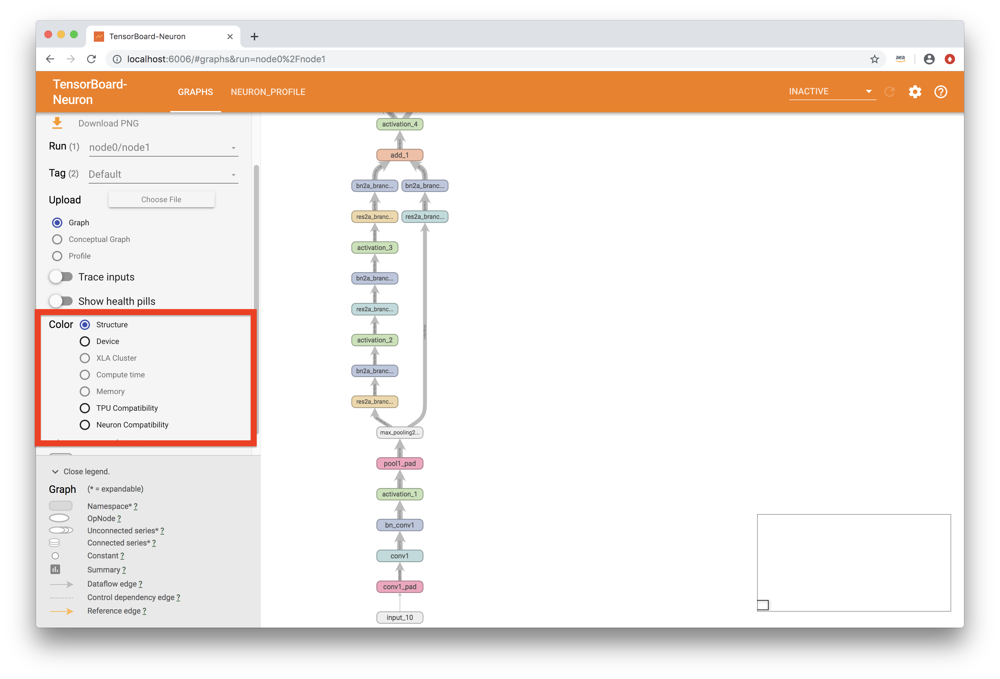

4.3 View compatible operators

Now, the graph should be colored red and/or green.  Green indicates that an operator that is compatible with Neuron devices, while red indicates that the operator is currently not supported.  If there are unsupported operators, all of these operators’ names will be listed under the “Incompatible Operations” section.
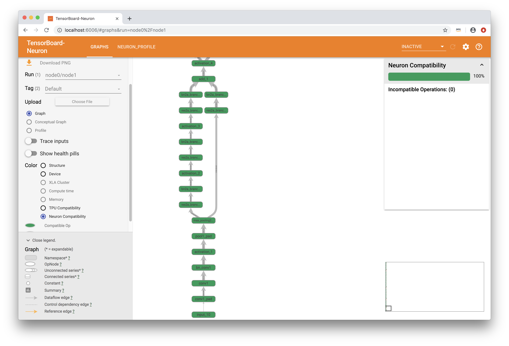
## How to: Visualize graphs run on a Neuron device

After successfully analyzing the profiled run on a Neuron device, you can launch TensorBoard-Neuron to view the graph and see how much time each operator is taking.

5.1 Navigate to the "Graphs" plugin

5.2 Select the “Neuron_profile” tag

The “neuron_profile” tag contains timing information regarding the inference you profiled.
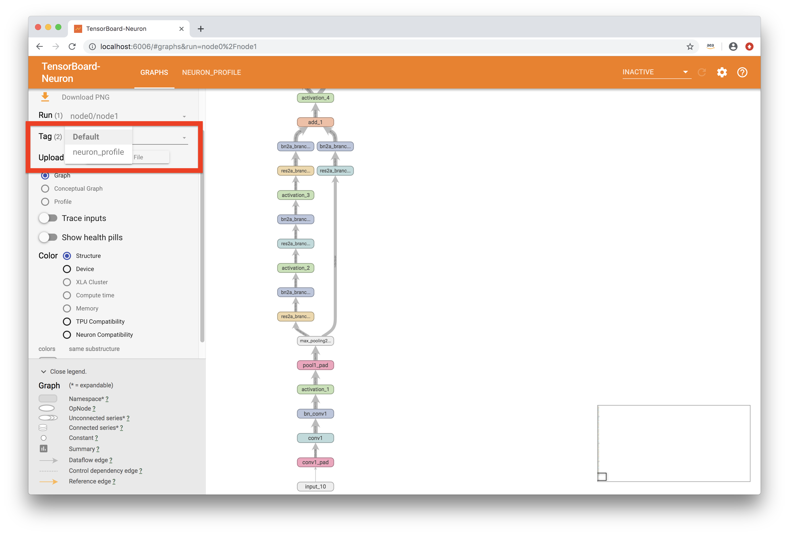
5.3 select “Compute Time”

In the navigation pane on the left, under the “Color” section, select “Compute time.”
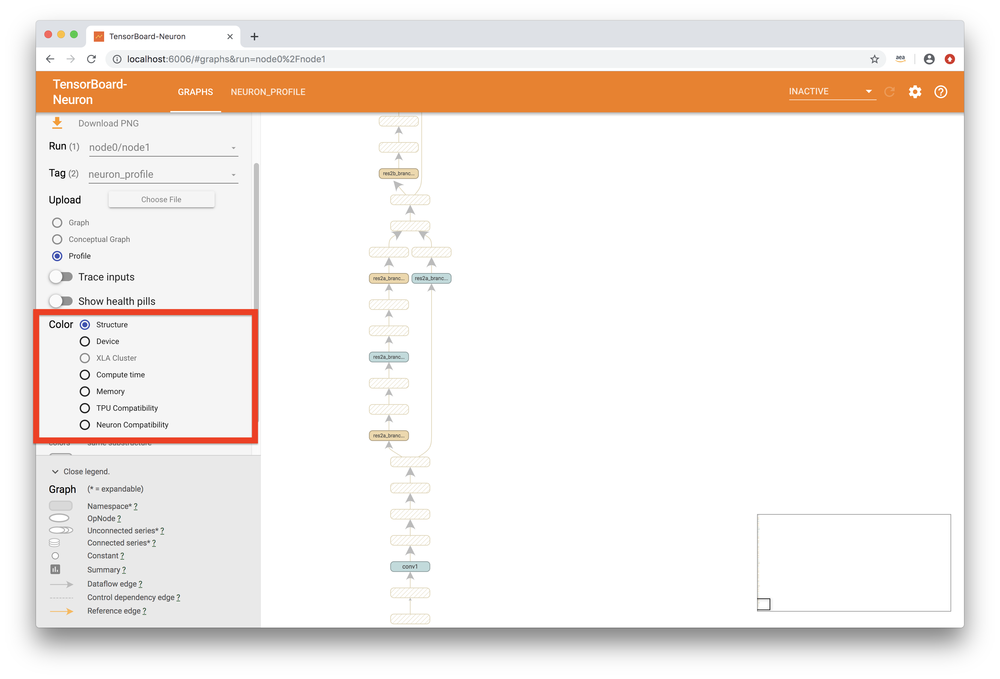
5.4 View time taken by various layers

This view will show time taken by each layer and will be colored according to how much relative time the layer took to compute.  A lighter shade of red means that a relatively small portion of compute time was spent in this layer, while a darker red shows that more compute time was used.  Some layers may also be blank, which indicates that these layers may have been optimized out to improve inference performance.  Clicking on a node will show the compute time, if available.
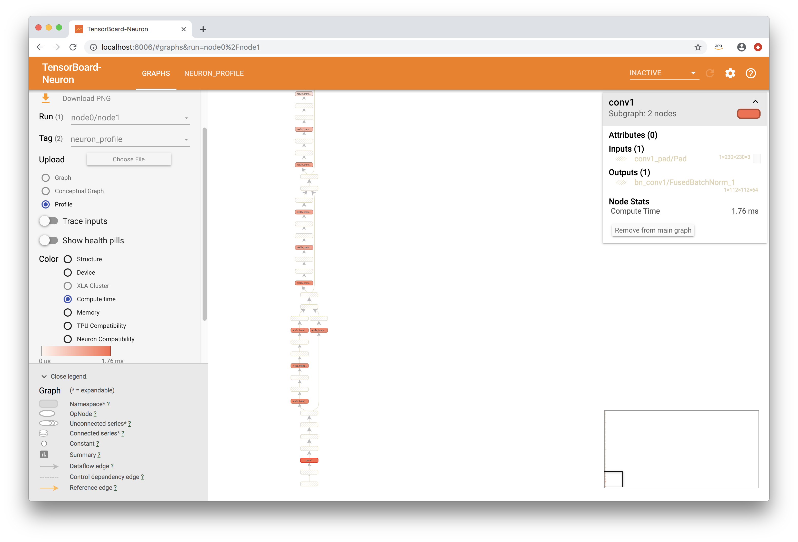
## How to: View detailed profile using the Neuron Profile plugin

To get a better understanding of the profile, you can check out the Neuron Profile plugin.  Here, you will find more information on the inference, including an overview, a list of the most time-consuming operators (op profile tool), and an execution timeline view (Chrome trace).

6.1 Select the “Neuron Profile” plugin

On the navigation bar at the top of the page, there will be a list of active plugins.  In this case, you will need to use the “Neuron Profile” plugin.
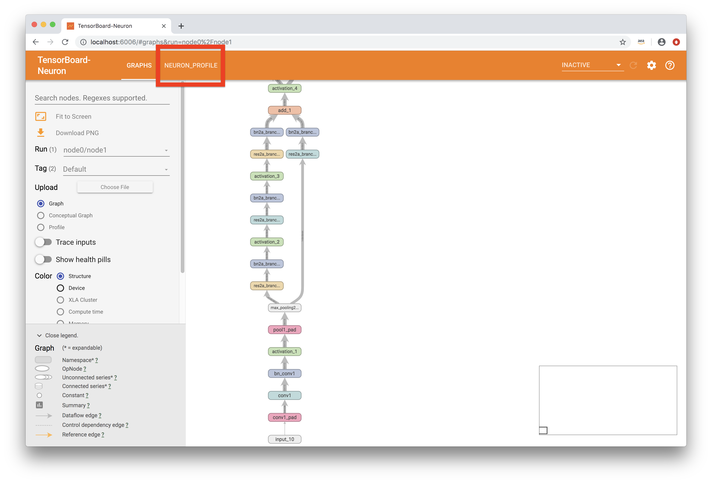The plugin may take a while to register on first load.  If this tab does not show initially, please refresh the page.

6.2 The Profile Overview

The first page you will land on in the Neuron Profile plugin is the overview page.  It contains various information regarding the inference.
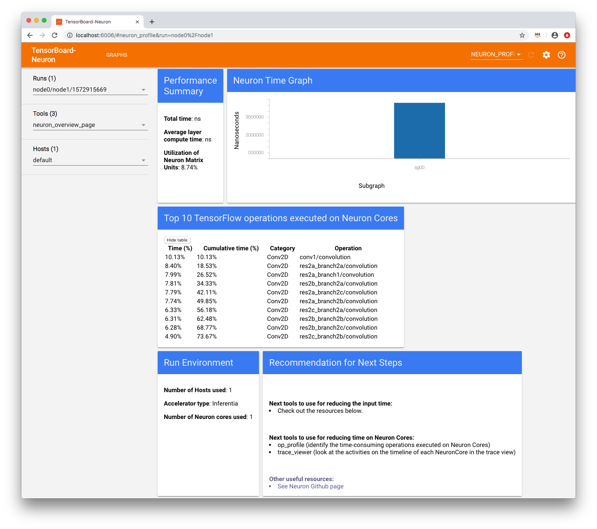
In the “Performance Summary” section, you will see execution stats, such as the total execution time, the average layer execution time, and the utilization of NeuronMatrix Units.

The “Neuron Time Graph” shows how long a portion of the graph (a NeuronOp) took to execute.

The “Top TensorFlow operations executed on Neuron Cores” sections gives a quick summary of the most time-consuming operators that were executed on the device.

“Run Environment” shows the information on devices used during this inference.

Finally, the “Recommendation for Next Steps” section gives helpful pointers to place to learn more about what to do next

6.3 The Operator Profile

In the “Tools” dropdown menu, select “op_profile.”

The “op profile” tool displays the percentage of overall time taken for each operator, sorted by the most expensive operators at the top.  It gives a better understanding of where the bottlenecks in a model may be.
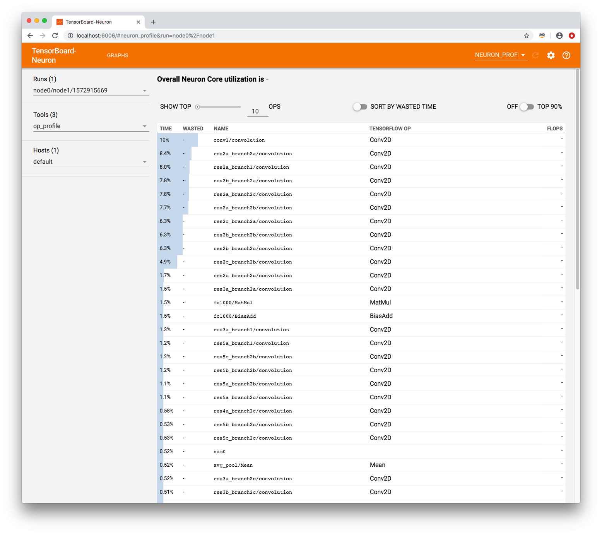

6.4 Chrome trace

In the “Tools” dropdown menu, select “trace_viewer.”

For developers wanting to better understand the timeline of the inference, the Chrome trace view is the tool for you.  It shows the history of execution organized by the operator names.

Please note that this tool can only be used in Chrome browsers.
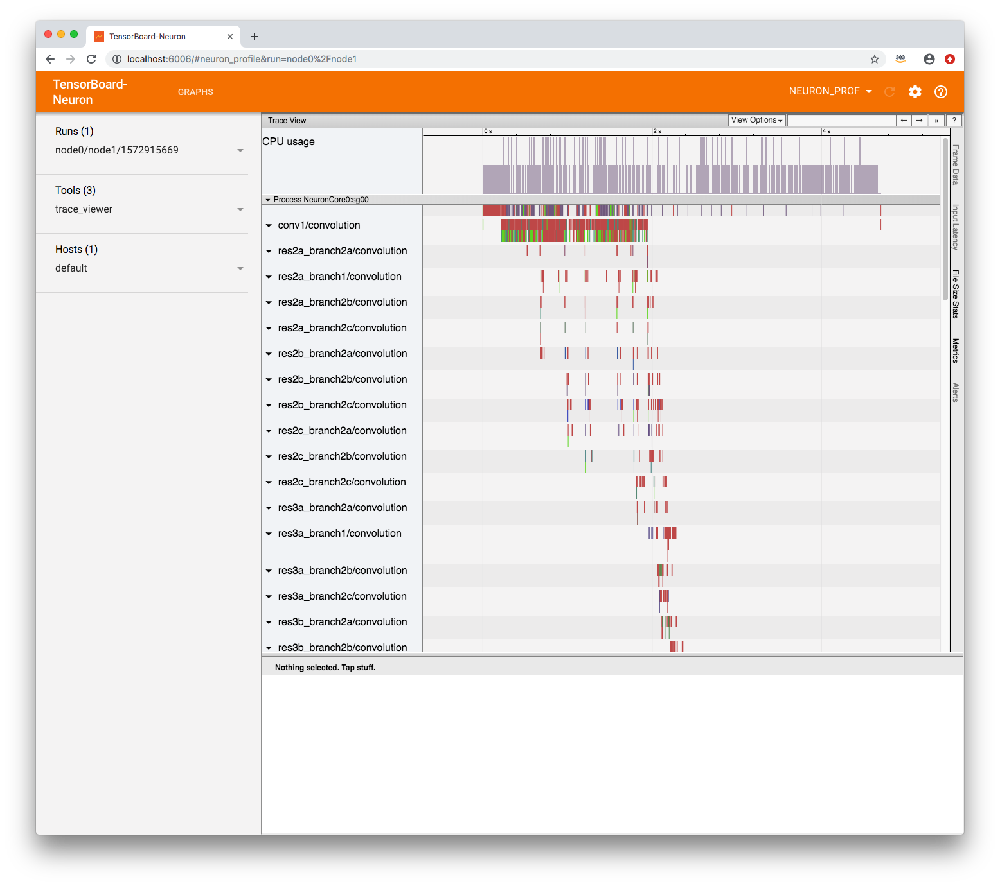

## How to: Debug an inference

7.1 Launch TensorBoard-Neuron and navigate to the webpage

To use the Debugger plugin, you will need to launch with an extra flag:

```
$ tensorboard_neuron --logdir ~/logs --debugger_port 7000
```

where 7000 can be any desired port number.

7.2 Modify and run your inference script

In order to run the inference in “debug mode,” you must use TensorFlow’s debug wrapper.  The following lines will need to be added to your infer_resnet50.py script.

```python
import os
import time
import numpy as np
import tensorflow as tf
from tensorflow.keras.preprocessing import image
from tensorflow.keras.applications import resnet50
from tensorflow.python import debug as tf_debug

tf.keras.backend.set_image_data_format('channels_last')

# The port must be the same as the one used for --debugger_port above
# in this example, PORT is 7000
DEBUG_SERVER_ADDRESS = 'localhost:7000'

# Create input from image
img_sgl = image.load_img('kitten_small.jpg', target_size=(224, 224))
img_arr = image.img_to_array(img_sgl)
img_arr2 = np.expand_dims(img_arr, axis=0)
img_arr3 = resnet50.preprocess_input(img_arr2)

# Load model
COMPILED_MODEL_DIR = './resnet50_neuron/'
predictor_inferentia = tf.contrib.predictor.from_saved_model(COMPILED_MODEL_DIR)

# Use the debug wrapper for TensorBoard
predictor_inferentia._session = tf_debug.TensorBoardDebugWrapperSession(
            predictor_inferentia._session, DEBUG_SERVER_ADDRESS)

# Run Inference and Display results
model_feed_dict={'input': img_arr3}
infa_rslts = predictor_inferentia(model_feed_dict)
print(resnet50.decode_predictions(infa_rslts["output"], top=5)[0])
```

After adding these modifications, run the script to begin inference.  The execution will be paused before any calculation starts.

7.3 Select the “debugger” plugin

On the navigation bar at the top of the page, there will be a list of active plugins.  In this case, you will need to use the “Debugger” plugin.
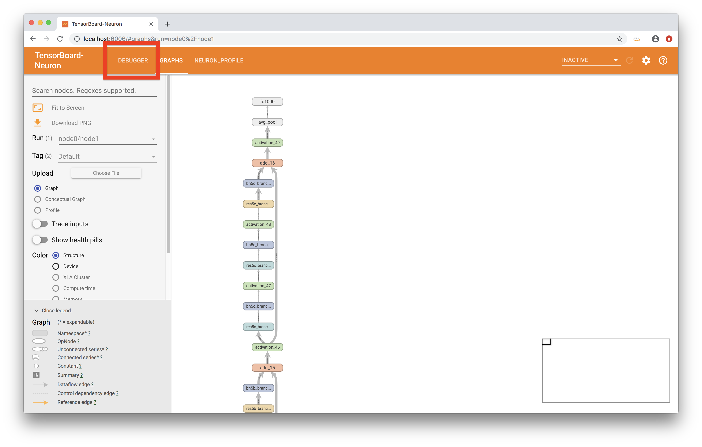
7.4 Enable watchpoints

In the “Runtime Node List” on the left, there will be a list of operators and a checkbox next to each.  Select all of the operators that you would like the view the tensor output of.
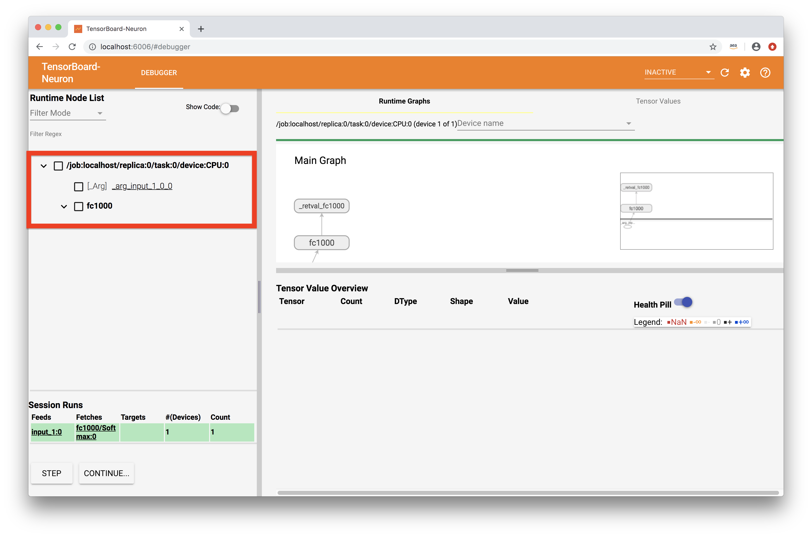
7.5 execute inference

On the bottom left of the page, there will be a “Continue...” button that will resume the inference execution.  As the graph is executed, output tensors will be saved for later viewing.
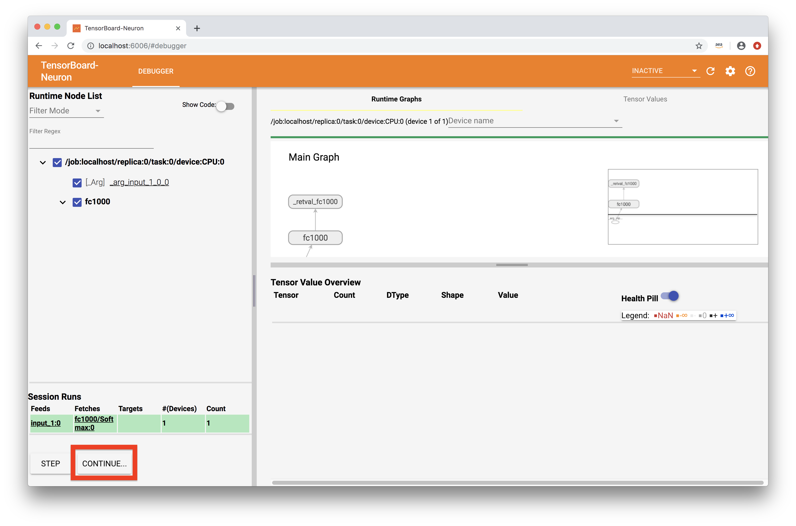
7.6 View tensors

At the bottom of the page, there will be a“Tensor Value Overview” section that shows a summary of all the output tensors that were selected as watchpoints in Step 4.
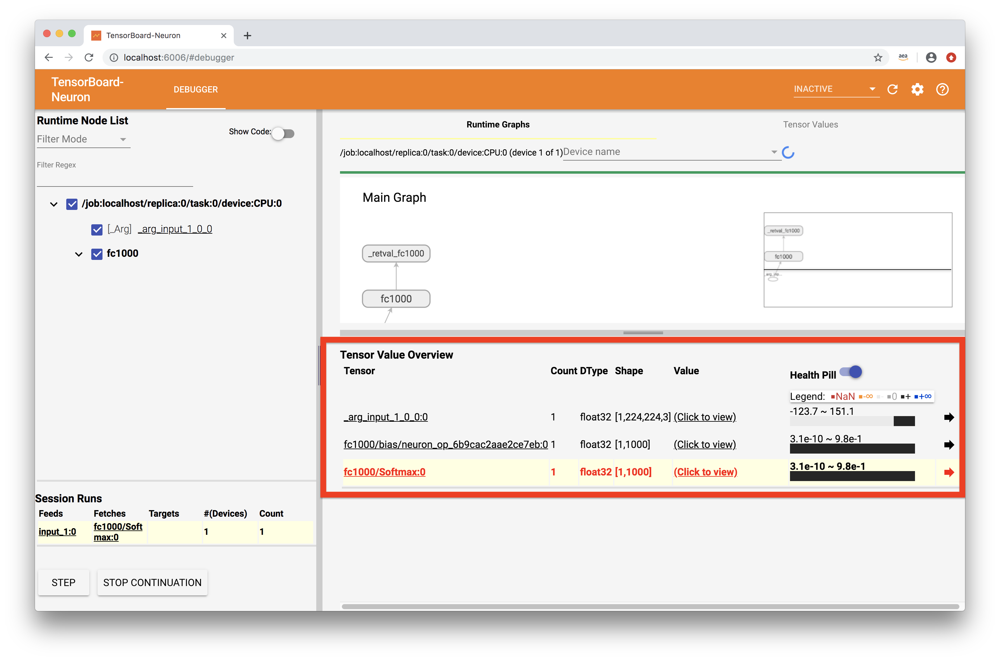To view more specific information on a tensor, you can click on a tensor’s value.  You may also hover over the bar in the “Health Pill” column for a more detailed summary of values.
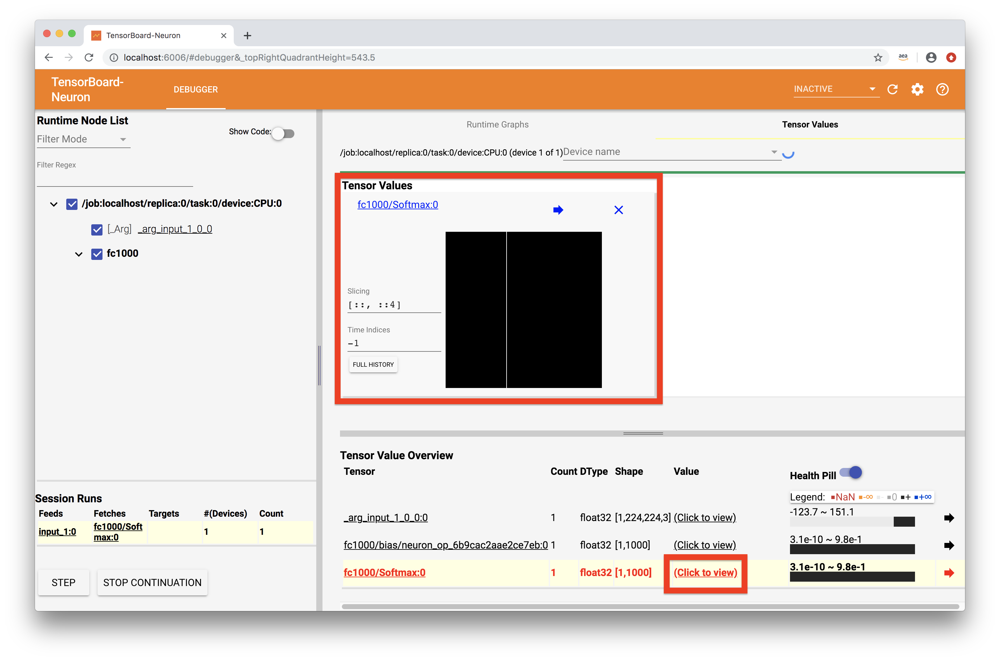
